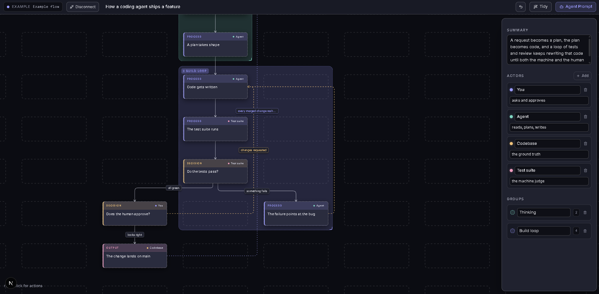

# Flow Visualizer

Turn an AI agent's explanation of how something works into an editable flow
diagram — tiles, decision branches, and feedback loops — with your edits
saving straight back to a JSON file.

**Live demo:** https://flow-visualizer-nu.vercel.app/

No flow of your own yet? Click **See an example flow** on the start screen to
explore a sample.



## How it works

1. Copy the agent prompt — a short JSON contract.
2. Hand it to a coding agent working in your repo.
3. The agent writes a small flow JSON file with one or more views.
4. Connect that file here — Browse or drag it in.
5. Choose a view, edit visually, and switch views from the top-left selector.

## Run

```bash
npm install
npm run dev   # http://localhost:3000
```

## Connecting a file

Browse to a `.json` flow file or drag it onto the start screen. Valid files use
a top-level `{ "views": [...] }` object; each view has its own title, steps,
actors, loops, and groups. After opening a file, choose the view to enter. Edits
autosave to `localStorage` and write back to the connected file after a short
pause; the watcher also reloads it if the file changes on disk. The **Agent
Prompt** button hands an agent the JSON contract — try
[examples/thermostat.json](examples/thermostat.json).

The file shape is `FlowFile` in [lib/types.ts](lib/types.ts); layout and
orthogonal routing still operate on one active `FlowView` at a time in
[lib/graph.ts](lib/graph.ts).

## Editing

- Drag tiles to rearrange; **Tidy** re-runs the automatic layout.
- Use the top-left selector to switch flow views.
- Use the toolbar **Step** and **Group** buttons to add quickly.
- Right-click the graph to add at a specific spot or open local actions.
- Click a tile to edit it; click its port, then another tile, to connect.
- Click any edge to restyle it — label, line (solid/dashed/dotted), and color.
- Cluster steps into labeled group regions; give tiles and edges custom colors.
- `Delete` removes the selection, `Esc` deselects.

## Hosting

Deploys to Vercel as a standard Next.js app, no config. The local-disk file
API (`/api/file/*`) is **disabled in production** for safety — hosted users open
files through the browser's File System Access API (Browse / drag-drop, on
Chromium-based browsers), which writes edits back to the file you choose. To run
a *local* production build with disk access, set
`NEXT_PUBLIC_FLOW_VISUALIZER_LOCAL_FILES=1` (never on a shared deployment).

## Stack

Next.js 15 (App Router) · TypeScript · Tailwind v4 · lucide-react

No canvas/graph library — tiles are absolutely-positioned divs over one SVG
edge layer in a panned/zoomed transform. Animations are pure CSS.
